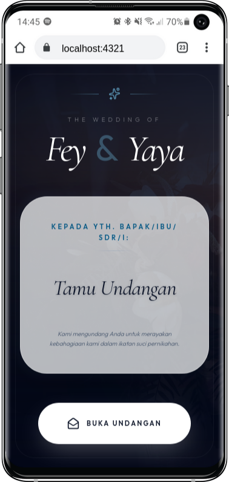

# Wedding Invitation Website

An elegant, modern, and interactive wedding invitation website built with Astro, React, Tailwind CSS, and SQLite. Features comprehensive guest management, real-time RSVP tracking, automated notifications, and professional design tools.



---

## Core Features

### User Experience

- **Digital Envelope**: Elegant opening animation with personalized guest names
- **Light & Dark Mode**: Automatic theme switching based on system preferences
- **Background Music**: Auto-playing ambient music with user interaction controls
- **Smooth Animations**: Scroll-triggered reveals, floating petals, and seamless transitions
- **Live Countdown**: Real-time timer counting down to the wedding ceremony

### Functionality

- **Guest Personalization**: Automatic name extraction from URL parameters
- **RSVP Management**:
  - Smart update system preventing duplicate entries
  - Real-time attendance statistics dashboard
  - Configurable guest count limits
  - IP-based rate limiting for spam protection
- **Guest Book**: Message collection with pagination and locked inputs for personalized links
- **Location Integration**: Direct links to Google Maps and calendar event creation
- **Photo Gallery**: Interactive lightbox viewer with keyboard navigation
- **Gift Registry**: One-click copy functionality for bank accounts and shipping addresses

### Technical Implementation

- **Dynamic Configuration**: Complete customization through environment variables
- **Server-Side Rendering**: Astro Node Adapter in standalone mode for optimal performance
- **SQLite Database**: Lightweight, fast, and self-contained data storage
- **Production Ready**: Pre-configured PM2 and Nginx deployment setup
- **PWA Support**: Installable web app with offline capabilities
- **Telegram Integration**: Real-time notifications for new RSVPs and messages

### Admin Dashboard

- **Protected Access**: Cookie-based authentication system
- **Data Management**:
  - View, edit, and delete RSVP entries
  - Manage guest messages and wishes
  - Bulk operations with confirmation dialogs
  - Real-time statistics overview
- **Export Capabilities**: CSV export for both RSVP and wishes data
- **QR Code Generator**:
  - Single guest QR code creation
  - Bulk generation from CSV import
  - Premium logo integration
  - ZIP download for batch processing
- **PDF Invitation Designer**:
  - Professional 4-page A5 floral template
  - Vector-based ornamental decorations
  - Multi-theme color schemes (Sage Green, Maroon, Gold, Dusty Blue)
  - Embedded QR codes for digital invitations
  - Bulk generation with progress tracking
  - Single and batch export options

---

## Project Structure

```
.
├── src/
│   ├── components/
│   │   ├── Admin/                  # Admin dashboard components
│   │   ├── Hero.tsx               # Landing section
│   │   ├── CoupleProfile.tsx      # Bride & groom profiles
│   │   ├── EventDetails.tsx       # Ceremony information
│   │   ├── Gallery.tsx            # Photo gallery
│   │   ├── RSVPForm.tsx           # RSVP management
│   │   ├── Wishes.tsx             # Guest book
│   │   ├── GiftInfo.tsx           # Gift registry
│   │   ├── QRCodeGenerator.tsx    # Single QR creation
│   │   ├── QRCodeManager.tsx      # Bulk QR management
│   │   └── InvitationManager.tsx  # PDF designer
│   ├── layouts/                   # Page layouts
│   ├── lib/
│   │   ├── db.ts                  # Database configuration
│   │   └── rateLimit.ts           # Rate limiting
│   ├── pages/
│   │   ├── api/                   # API endpoints
│   │   ├── admin.astro            # Admin panel
│   │   ├── qrcode.astro           # QR generator page
│   │   └── index.astro            # Main page
│   ├── services/                  # API service layer
│   ├── styles/                    # Global CSS
│   ├── utils/
│   │   ├── calendarUtils.ts       # Calendar integration
│   │   └── telegram.ts            # Notification system
│   └── types.ts                   # TypeScript definitions
├── database/                      # SQLite database location
├── public/                        # Static assets
├── .env                          # Configuration file
├── astro.config.mjs              # Astro configuration
├── ecosystem.config.cjs          # PM2 configuration
├── nginx.conf                    # Nginx configuration
└── package.json                  # Dependencies
```

---

## Configuration

All website content is managed through environment variables. Copy `.env.example` to `.env` and customize accordingly.

### Basic Settings

```properties
HOST=0.0.0.0
PORT=4321
DB_NAME=wedding.db
ADMIN_PASSWORD=your_secure_password
```

### Telegram Notifications

```properties
TELEGRAM_BOT_TOKEN=your_bot_token
TELEGRAM_CHAT_ID=your_chat_id
```

### Public Information

```properties
PUBLIC_HERO_IMAGE=https://your-image-url.jpg
PUBLIC_HERO_CITY=City, Country
PUBLIC_MUSIC_URL=https://your-music-url.mp3
PUBLIC_RSVP_MAX_GUESTS=5
```

### Couple Details

```properties
PUBLIC_BRIDE_NICKNAME=Name
PUBLIC_BRIDE_FULLNAME=Full Name
PUBLIC_BRIDE_PARENTS=Daughter of...
PUBLIC_BRIDE_INSTAGRAM=username
PUBLIC_BRIDE_IMAGE=https://image-url.jpg

PUBLIC_GROOM_NICKNAME=Name
PUBLIC_GROOM_FULLNAME=Full Name
PUBLIC_GROOM_PARENTS=Son of...
PUBLIC_GROOM_INSTAGRAM=username
PUBLIC_GROOM_IMAGE=https://image-url.jpg
```

### Venue Information

```properties
PUBLIC_VENUE_NAME=Venue Name
PUBLIC_VENUE_ADDRESS=Complete Address
PUBLIC_VENUE_LAT=-6.2088
PUBLIC_VENUE_LNG=106.8456
```

### Event Schedule

```properties
PUBLIC_AKAD_TITLE=Ceremony Title
PUBLIC_AKAD_DAY=Sunday
PUBLIC_AKAD_DATE=11 October 2025
PUBLIC_AKAD_START=08:00
PUBLIC_AKAD_END=10:00
PUBLIC_AKAD_ISO_START=2025-10-11T08:00:00+07:00
PUBLIC_AKAD_ISO_END=2025-10-11T10:00:00+07:00

PUBLIC_RESEPSI_TITLE=Reception Title
PUBLIC_RESEPSI_DAY=Sunday
PUBLIC_RESEPSI_DATE=11 October 2025
PUBLIC_RESEPSI_START=11:00
PUBLIC_RESEPSI_END=14:00
PUBLIC_RESEPSI_ISO_START=2025-10-11T11:00:00+07:00
PUBLIC_RESEPSI_ISO_END=2025-10-11T14:00:00+07:00
```

### Complex Data (JSON Format)

```properties
PUBLIC_BANK_ACCOUNTS=[{"bank":"Bank Name","number":"1234567890","name":"Account Name"}]

PUBLIC_LOVE_STORY=[{"date":"2020","title":"First Meeting","desc":"Description..."}]

PUBLIC_GALLERY_IMAGES=["https://image1.jpg","https://image2.jpg"]
```

---

## Installation & Development

### Prerequisites

- Node.js v18 or higher
- Yarn or NPM package manager

### Setup

1. Clone the repository

```bash
git clone https://github.com/zulfikriyahya/wedding-invitation.git
cd wedding-invitation
```

2. Create configuration file

```bash
cp .env.example .env
```

3. Install dependencies

```bash
yarn install
```

4. Start development server

```bash
yarn dev
```

The website will be available at `http://localhost:4321`

---

## Production Deployment

### Build Process

1. Generate production build

```bash
yarn build
```

2. Upload to server

```
- dist/
- .env
- package.json
- ecosystem.config.cjs
- yarn.lock
```

3. Install production dependencies

```bash
cd /var/www/your-domain
yarn install --production
```

4. Start with PM2

```bash
pm2 start ecosystem.config.cjs
pm2 save
pm2 startup
```

5. Configure Nginx

```bash
sudo ln -s /etc/nginx/sites-available/wedding /etc/nginx/sites-enabled/
sudo nginx -t
sudo systemctl restart nginx
```

---

## Personalized Invitations

Create unique invitation links for each guest by adding the `to` parameter:

```
https://your-domain.com/?to=Guest+Name
```

This will:

- Display guest name on envelope
- Pre-fill RSVP form with locked name field
- Pre-fill guest book with locked name field
- Personalize hero section greeting

---

## Admin Panel

Access the admin dashboard at `/admin` using the password configured in `.env`.

### Features

- Real-time RSVP statistics
- Guest management with edit and delete capabilities
- Bulk operations for data management
- CSV export functionality
- QR code generation (single and bulk)
- PDF invitation designer with multiple themes

---

## Data Export

Export guest data in CSV format:

- RSVP Data: `/api/export-rsvp`
- Guest Wishes: `/api/export-wishes`

---

## Technology Stack

- **Framework**: Astro with SSR
- **UI Library**: React
- **Styling**: Tailwind CSS v4
- **Database**: SQLite with better-sqlite3
- **Process Manager**: PM2
- **Web Server**: Nginx
- **PDF Generation**: jsPDF
- **QR Codes**: qrcode.react
- **File Processing**: PapaParse, JSZip

---

## License

MIT License - Created by Yahya Zulfikri
